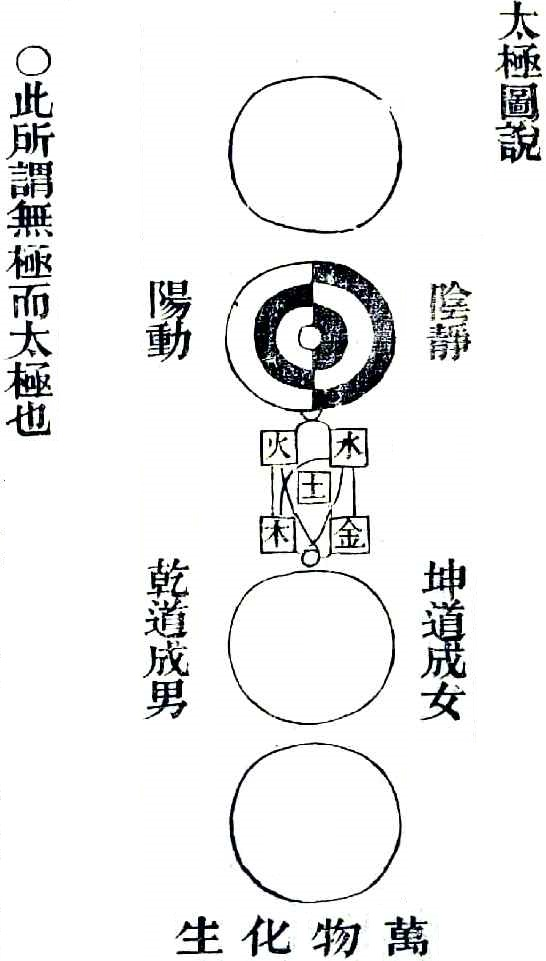

> 写在前面：
>
> 1. *哲学这部分的内容很多，想要更详细学习可以搜索**王德峰**老师进行学习。*
> 2. *陈老师所讲述的关于西方伪史的部分，我持保留意见，希望大家见仁见智。*
> 3. *陈老师这部分的讲课内容主要分为三部分：*
>    - *哲学是什么，可以干什么等问题*
>    - *中国哲学发展历史*
>    - *西哲（黑格尔、康德）*
> 4. *哲学的内容很多，若详细学习，需要学习的内容也很多，建议大家学习自己感兴趣的部分学习*
>
> 推荐书目：
>
> - 《大众哲学》——艾思奇
> - 《中国哲学史》——冯友兰
> - 《中国哲学十五讲》——杨立华

## 1. 哲学概述

- 哲学是智慧的探索
- 哲学是**批判性**的智慧
- 指向未来，朝向远方
- 哲学是人类精神的**反思**（所谓反思就是人类精神反过来以自己为对象而思之）
- 哲学的功能不是为了增进正面的知识，而是为了提高人的心灵，超越现实世界，体验高于道德的价值

一个民族在精神的底层，总存在着一种哲学。这种哲学或者是清晰的，发挥着批判、反思与引领的作用，或者是模糊的，就像无意识一样，支撑着日常生活和思维方式，安顿着人们的生命与心灵。(续)

哲学的前景，应该跟人类社会共存，因为将来的人类社会，智力是主要的，认识是主要的。

哲学跟宗教最大的不同是宗教的基础在于信仰，哲学的基础在于提出问题，研究问题。

人类的进步就在于不断地发现新问题，研究和解答新问题，这是哲学的任务。

哲学总是围绕着根本的问题展开，但根本的问题在不同的时代、不同的技术情境中，有着不同的表现方式，在这个意义上，哲学是在不断变化的、开放的。

哲学学科通常分为价值论、认识论和形而上学领域。

+ 价值论关注于价值、规则及规范的来源和辩护问题，什么使得一个行动在道德上是允许的？
+ 认识论关注人类的知识。知识由什么构成？如何证明知识正当？
+ 形而上学探讨的是世界的基本特征。什么是原因？人类是自由的吗？理性的含义是什么？

哲学的心灵是博爱，哲学的头脑是智慧。

哲学作为人类理论思维的最高形式，在整个知识结构和体系中，肩负着与具体科学不同的特殊使命，也就是从总体上把握人与世界、自己与他者关系的整体结构、普遍形式和一般内容，既立足于具体科学，又保持着对具体科学的超越性。因此，哲学的思维方式也就表现为具有高度的概括性和抽象性。

哲学不是在旭日东升的时候在蓝天里翱翔，而是在薄暮降临的时候才悄然起飞。这说明哲学是一种反思活动，是一种沉思的理性。

冯友兰认为，人类要思考，首先要弄清楚能够思考什么，这就是说，在对宇宙、人生和知识进行思考之前，我们先要对思想进行思考。当我们对思想本身进行思索或谈论时，这种思索和谈论的本身也是知识，它是“关于思索的思索”。

## 2. 哲学专业主要课程

- 马克思主义哲学原理
- 中国哲学史
- 西方哲学史
- 马克思主义哲学史
- 哲学问题导论
- 逻辑学导论
- 伦理学概论
- 宗教学概论
- 政治哲学导论
- 科学技术哲学
- 美学原理
- 马克思主义哲学经典
- 中国哲学经典
- 西方哲学经典
- 历史唯物主义和历史哲学
- 数理逻辑
- 分析哲学
- 现象学和解释学

## 3. 人生四境界

+ ”自然境界“——动物的人：处于这个境界中，人是不自觉的、为私的、社会的公民
+ ”功利境界“——现实的人：处于这个境界中，人是自觉的、为私的、社会的公民
+ ”道德境界“——道德的人：处于这个境界中，人是自觉的、为空的、社会的公民
+ ”天地境界“——宇宙的人：处于这种境界中，人是自觉的、为公的、宇宙的公民

学哲学、人文科学和各种科学协调起来，实现人的境界飞升

## 4. 哲学的分类

- 西方哲学
- 中国哲学
- 印度哲学

## 5. 哲学的内涵

1. 本体论
2. 自然观
3. 社会历史观
4. 人生观
5. 价值观
6. 审美观
7. 伦理关系
8. 认识论
9. 方法论

## 6. 哲学的特殊意义和价值

哲学非科学，哲学不具有任何科学的基本特征，难以验证、因人而异、因时因事而异，不是像自然科学那样的科学知识。

哲学不是科学，正是其存在的意义和价值所在。

## 7. 哲学是思维的艺术

>“树上有十只鸟，开枪打死一只，还剩几只？”
>
>学生反问：“是无声手枪吗？”
>
>老师答：“不是。”
>
>学生问：“枪声有多大？”
>
>老师答：“80到100分贝。”
>
>学生说：“那就是说会震的耳朵疼。”
>
>老师答：“是。”
>
>学生问：“在这个城市里打鸟犯不犯法？”
>
>老师答：“不犯法。”
>
>学生问：“您确定那只鸟真的被打死了？”
>
>“确定”，老师已经不耐烦了。“拜托你告诉我还剩几只就行了，OK？”
>
>学生问：“OK，树上的鸟有没有聋子？”
>
>老师答：“没有。”
>
>学生问：“有没有关在笼子里的？”
>
>老师答：“没有。”
>
>学生问：“边上还有没有其他的树，树上有没还有没有其他的鸟？”
>
>老师答：“没有。”
>
>学生问：“有没有残疾的或饿得飞不动的鸟？”
>
>老师答：“没有”
>
>学生问：“算不算怀在肚子里的小鸟？”【学生问错了，幼鸟不在肚】
>
>老师答：“不算。”
>
>学生问：“打鸟人的眼有没有花？保证是十只？”
>
>老师答：“没有花，就十只。”
>
>老师已经满头是汗了，且下课铃响了，但学生还在问：“有没有傻到不怕死的？”
>
>老师答：“都怕死。”
>
>学生问：“会不会一枪打死两只？”
>
>老师答：“不会。”
>
>学生问：“所有的鸟都可以自由活动吗？”
>
>老师答：“完全可以。”
>
>这时学生才满怀信心地说，如果您的回答没有骗人，打死的鸟要是在树上没掉下来，那就剩一只；如果掉下来，那就一只不剩。

哲学背后是严密的逻辑思维，是一种论辩的思维，穷追猛打，无边无际。

学子哲学的过程中，会提高思维的艺术，来更加深入地深刻地思考现实。

## 8. 哲学是一种意识形态

相同的人说相同的话，不同的人说不同的话。哲学是一种意识形态，具有鲜明的阶级性。

## 9. 反对禁欲主义在西方哲学发展中的枢纽作用

西方社会存在一个中世纪的禁欲主义时代，然后，文艺复兴，近现代开启纵欲主义。

追求知识、自由、平等，形成了人文主义和自然哲学两股思潮。

## 10. 哲学的基本问题

物质与精神是哲学的基本问题，也是为人做事的基本问题。

+ 人有双重生命（物质主体和精神主体的统一）
+ 人生的全部活动和全部真谛
+ 反对物本主义（漠视精神的作用）

## \* 11. 中国思想史发展脉络

- 夏商周：周易
- 春秋战国：孔孟老庄
- 魏晋时期：魏晋玄学（王弼、郭象）
- 北宋时期：无极太极阴阳五行仁义礼智信共演乾坤男女天地万物的思想体系（系统论的世界本体论）
- 五四运动：马克思主义

## 12. 物质第一 精神第二

性相近也，习相远也。——孔子（前551一前479）

- 人性指的是人不得不如此的本质倾向。
- 既揭示出了人的相近的本质倾向，从而根源于普遍的人性基础上的根本价值找到了确实的基础。
- 又通过指出环境对人的影响，为人与人之间的现实差距提供了有说服力的解释。

## 13. 立与达，富与贵

- 富贵的获得是有其偶然性的
- 真正必然性的东西——“我欲仁，斯仁至矣”

## 14. 论自我

+ 将自我想象成完全独立于他人
+ 我的一部分掌控在别人那里，我的内在的一部分又掌控着别人
+ 有来有往，来来往往

## 15. 论他人

他人不在自我之外

没有他人的概念，自我的概念也根本无从谈起

每个具体的自我的品格，都在对比中包含了他人的品格

生命相连

## 16. 性善论

孺子入井——侧隐之心。

恻隐之心，仁之端也；羞恶之心，义之端也：辞让之心，礼之端也；是非之心，智之端也。

善的表现

日常语言当中，隐含对善的根源性的理解

## 17. 无爱和兼爱都不对

无爱：自私非无爱，彻底自私曰无爱

兼爱；绝对平均地爱一切人

- 杨氏为我，是无君也，极端利己主义从根本上动摇了社会、国家的基础。
- 墨氏兼爱，是无父也，爱无差等的理论和实践，伤及了人伦的根本。

## 18. 养气、养浩然正气

- 道德修养带来身心的整体提升，有两条路径：通过心灵的内在改变或者通过身体的外在约束和调整引生内在的改变
- 内外交养
- 只谈修身，而不讲修心，强调在事上用功

## 19. 是非

- 知道是非，超越是非，在永恒发展中掌握是非影响是非的方向和倾向
- 大部分人只能自知其知，而不知人之知。倾向于讲自己的一域之知普遍化为统一的是非标准
- 能人达者，不立是非，亦不简单地消解是非
- 道枢：枢轴为转动的基础，其本身却并不随车轮转动

## 20. 齐物

齐物：人尽其才，物尽其用；人人关联，物物关联，人物关联，自由平等

- 差异——利用——差异——利用。
- “齐”，并不消灭差异性，相反，正因差异性，才需要“齐”，进而形成人类繁荣热闹景象，进而实现宇宙无穷繁华壮观。
- 规定了人与人的秩序，诞生、形成、规定了宇宙万物的秩序。文明借此展开。

## 21. 魏晋玄学的言意之辩

突破语言和思维的障碍，**直奔问题的核心**：

- 语言在表达终极实在时的局限性
- 语言哲学**用语言分析消解哲学问题**
- 魏晋玄学用语言表达和把握终极实在

魏晋玄学的四个转向：

1. 面向问题，不再面向经典
2. 说不了的，不再说了
3. 打破门户、学派之成见
4. 行为出格，开一代新风尚

## 22. 从宇宙论到本体论

魏晋乱世的哲学突破——从宇宙论到本体论。

占筮要用五十根蓍草，但问题是五十根蓍草，有一根是不用的，这不用的一根怎么理解呢？

- 汉代人的宇宙论解释，是完全质料层面的。没有体用、本末的区别，没有本质和现象的差异
- “不用之一”是进一步探索万物背后的本体、存在的根据

## 23. “无”的本体论含义

- 无形无名者，万物之宗也。
- **一个事物的“有”恰恰是通过否定性建立的**。某个东西是白的，同时意味着不是其他的任何颜色
- “无”的动词属性。如同用凿子去雕一个石像
- **一切有恰恰因无发挥作用**

> 讨论“无”的本体论意义，对每个人，具有什么具体的作用呢？
>
> 因为“无”才会“有”，在日常、学习生活中，不要害怕被否定，正是因为这些否定，形成了更优秀的自我。

## 24. 道与自然

道以“让一切**自然而然**的方式”发挥作用

- “道法自然”即“自已而然”，让万物都成为它自己
- 让每个人按照自己的本性而生活，就是一个理想的社会

## 25. 无为政治

> 王弼（226年~249年），字辅嗣，山阳高平（今山东省微山县）人。 三国时期曹魏经学家、哲学家，魏晋玄学的代表人物及创始人之一。

王弼的政治哲学——无为政治

- “无为政治”实际上就是“道法自然”的本体论思想在政治思想上的体现
- 天地对任何事物都没有格外的爱，也没有格外的恨，所以说“不仁”。天地不做任何干涉，而是让万物自然形成自相治理的关系，从而使每个事物都能“各适其用”。这就是无为政治的基本原理。
- 天若有情天亦老，人间正道是沧桑。

## 26. 两种观物方法：有欲与无欲

- 《老子》第一章“故常无欲，以观其妙；常有欲，以观其徽”
- 无欲以观物之生，有欲以观物之成

如何处理未来与过去：

- 第一，常无欲。勇敢为主。
- 第二 常有欲。谨慎为主。

## 27. 崇本息末，适可而止，过犹不及

- “崇本息末”的“末”指过度、邪恶的东西
- “道生一，一生二，二生三，三生万物”一节时，王弼说：“从无之有，数尽乎斯，过此以往，非道之流”
- “数尽乎斯”即分化到“三”就应该停止了
- “从无之有，数尽乎斯”，既强调了官僚系统的必要性，有指出了这种非必要性的限度
-  “过此以往，非道之流”的末，即过度和淫邪才是应该止息的

## 28. 无为：杜绝以干好事之名行干坏事之实

- “绝圣弃智，民利百倍；绝仁弃义，民复孝慈；绝巧弃利，盗赋无有”——《道德经》。对此，王弼注曰：圣智，才之善也；仁义，行之善也；巧利，用之善也。
- 社会只要有对圣智、仁义、巧利的过度提倡过度追求，就一定会产生竞争性的欺诈行为。
- “属之于素朴寡欲”。“朴”和“素”都是未经雕琢的意思。对未经雕琢的自然的破坏，来源于对“名”和“利”的追求。
- 朴素的标准是什么呢？常之为物，不偏不彰，无嫩昧之状，温良之象，故曰“知常曰明”也。即知常就好，不要过分夸张就好。

## 29. 无为：圣人人格

- “古之善为士者，微妙玄通，深不可识。夫惟不可识，故强为之容。豫焉若冬涉川，尤兮若畏四邻，俨兮其若容，焕熙若冰之将释，敦兮其若朴，旷兮其若谷，混兮其若浊”——《道德经》
- 圣人的欲求、鼓励、反对，都是无法测知的。正因为这样的愚纯，人们才有可能回归自己的本性，朴素地生活，本分地生活。不至于想入非非，难以胡作非为。
- 圣人由于神明桌越，所以能够通达作为万物之本的“无”。由于五情备具，所以得心应手哀乐之情来应接事物。

## 30. 君子人格：无为超越，保私为公

- 无为超越
- 以公私为是非善恶的根本，是嵇康会通儒道的关键所在

## 31. 养生

> 嵇康（224－263，一说223－262），字叔夜，汉族，三国时期魏国谯郡铚县（今安徽省宿州市西）人。著名思想家、音乐家、文学家。
>
> *以下的内容分别摘自嵇康的《养生论》、《答向子期难养生论》*

养生：生活方式要符合基本的道理。

- 清虚静泰，少私寡欲。
- 知名位之伤得，故忽而不营，非欲而强禁也；知厚味之害性，故弃而弗顾，非贪而后抑也。
- 外物以累心不存，神气以醇白独著，旷然无忧患，寂然先思虑。
- 又守之以一，养之以和，和理日济，同乎大顺。

- 然后蒸以灵芝，润以醴泉，晞以朝阳，绥以五弦，无为自得，体妙心玄，忘欢而后乐足，遗生而后身存。
- 外物虽丰，哀亦备矣。有主于中，以内乐外，虽无钟鼓，乐已具矣。故得志者，非轩冕也；有至乐者，非充屈也。

## 32. 快乐与愉悦的不同

- 不要偏执于快乐里。 
- 应该追求并实现愉悦的生活。 
- 音乐美学原则。

## 33. 造物无主

> 郭象（约252年-312年），字子玄，河南洛阳人。西晋时期的哲学家、玄学家。
>
> 《郭象<庄子注>研究》——杨立华

**无“无”**的本体论：造物无主——无不是本体，众有才是本体：主在自我

- 王弼讲“以无为本”,“无”对“万有”的作用体现为“生之”和“成之”两个方面。
- “无”既然就是没有，因此不能生“有”，那么事物的属性就只能回到每个事物的内在。
- 万物自生，不是由一而生。秩序自然

## 34. 遨游必然王国，圈画新的边界

- 边界
- 早知，早好
- 边界之外皆尘垢、缥缈
- 本分、边界**是可能性**，非现实性

## 35. 自为与相为

自为与相为：身不由己为主，见机行事为辅

- 不知其所以然而然、不得不然。
- “自为“和“相为”。
- 家庭、婚姻、社会、政治、历史……今天的社会就是“自为”和“相为”的聚合体

## 36. “冥物”、“无待”、“逍遥”

消弭界限，浑然一体，打通一切,自然逍遥

无待-自足-逍遥-无待-无对

- “冥物”：
- “无待”：无条件的、不针对任何的
- “逍遥”：自由，无阻碍
- “无对”则无是非、彼此、生死的界限。

## 37. 生死

- 死与生各自成体，独立行走，人之生，聚集生死，生死仅缘于一人而，人之亡，生死分手于该人，然而，生死继续。
- 生时焦虑死，死后怀疑生，无意义。把自己的本分和定分都充分地实现出来，乃生命完足，死不足惜。把自己的焦虑彷徨都隐忍地显现显露，就是对死亡的尊重，生不足恋。
- 变化日新月异，人不用等到大限到来时才面对死亡，每一天当中都在经历无数生死。揭天地以趋新，负山岳以舍故。
- 每一刻开启的都是完全意义上的新生，每一刻经历的都是完全意义上的故亡。郭象"死与生各自成体“的思想,为一种积极、饱满的人生态度确立了根本，为一种向上的、昂扬的现实主义精神奠定了基础。

## 38. 太极诚体

> 北宋周敦颐（1017-1073），长期做州县界，处置事情严肃精密，为人有古风。“不卑小官”，在世的时候影响并不大。
>
> 熏染儒家乐感文化。拥有温暖的、有春天意思的自光。
>
> “风月无边”。“庭草交翠”。
>
> 为中国哲学的划时代意义贡献卓越。
>
> - “圣希天”：圣人向天地学习；“贤希圣”：贤人向圣人学习；“士希贤”：士向贤人学习
> - “志伊尹之所志”（重道义）；“学颜子之所学”（尚智慧)

- 太极、阴阳、五行，是关于世界本体论的。
- 无极而太极——阳动、阴静——火、水、木、金、土五行（仁、义、礼、智、信五德）——乾道成男、坤道成女——万物生化

> 详见太极图。文字表达拥有先后的时间顺序，然而，这个表送出来的系列，是同时发生的

> 无极而太极。太极动而生阳，动极而静，静而生阴。静极复动。一动一静，互为其根；分阴分阳，两仪立焉。
>
> 阳变阴合，而生水火木金土，五气顺布，四时行焉。阳变阴合，而生水火木金土，五气顺布，四时行焉。
>
> 五行一阴阳也，阴阳一太极也，太极本无极也。
>
> “乾道成男，坤道成女。”二气交感，化生万物，万物生生而变化无穷焉。
>
> 惟人也，得其秀而最灵，形既生矣，神发知矣！ 五性感动而善恶分，万事出矣！
>
>  故圣人与天地合其德，日月合其明，四时合其序，鬼神合其吉凶。
>
> ——《太极图说》周敦颐

## 39. 人是万物中最灵秀的也是最需要治理的

- 人是所有万物当中最灵秀的。人是天地万物中最具主动性的。
- 人最完整地禀得了天地当中最精华的东西。人即天，天即人，天人合一
- 天道与人性的一贯。天地的本性就是人的本性，人类社会的所有道德法则都源于天地的本性。儒家要在天地的本性当中辨认出价值的原则来，而不是用自然消解人类社会的道德价值。
- 人得其秀而最灵，选择的无限开放，但人类社会反而是需要洽理的。

## 40. 圣人的样子

- 寂然不动者（动于本分之事），诚也。
- 感而遂通者（不因私欲障碍），神也。
- 动而未形、有无之间者（过程管理，勤于用功），几也。
- 诚精故明，神应故妙，几微故幽。诚、神、几，曰圣人。

## 41. 用刑

- 天以春生万物，止之以秋。
- 一般的老百姓欲动情胜，趋于过度，戕害人伦，用刑制止。
- 儒家的一贯基本观念。“礼乐刑政，四达而不悖”。阻恶行正，用刑必然。

## 42. 北宋程颢对佛教的批判

- 反对佛的“理”，要“自明吾理”，为儒家生活方式确立哲学基础，为合道理的生活方式确立哲学基础。
- 好的生活安排背后得有形上学的、哲学的依据。
- 佛学以生死恐动人。死之事即生是也。
- 苦乐同根，将苦乐的共同根基——“牵挂”去除、追求极乐。以实有的世界为幻相，是自私。有生就有死，有乐便有哀。
- 佛教自私独善，不能普遍化。
- 佛教像淫声美色，正常人要远离它。

## 43. 建构儒家话语

- “—本”
- “天理”
- “仁”
- “敬”、“敏”

## 44. 横渠四句

> 张载（1020年—1077年），字子厚，世称横渠先生，尊称张子。凤翔郿县（今陕西眉县）人。北宋思想家、教育家、理学创始人之一。
>
> 张载世居大梁（河南开封），去世于1077年（再过两年，南宋灭亡）。因其父卒于涪州任上，张载兄弟二人在扶柩归乡的途中资斧罄（器皿）尽，就停留在陕西凤期府眉县横渠镇。因其长期在横渠镇讲学，所以世称横渠先生。
>
> 张载生平有几个重要的转折点：
>
> 1. 二十一岁时上书谒见范仲淹。
> 2. 三十六岁时开始与二程兄弟往来。
> 3. 晚年在横渠镇讲学的七年。

横渠四句：为天地立心，为生民立命，为往圣继绝学，为万世开太平。

> 乾称父，坤称母；予兹藐焉，乃混然中处。故天地之塞，吾其体；天地之帅，吾其性。民，吾同胞；物，吾与也。——《西铭》张载

## 45. “无”在概念上不能成立

- 无是老庄哲学的重要概念
- 天地间并没有“无”的存在
- 《易传》只讲“幽明”，即可见和不可见
- “不言有无”正是《周易》的高明所在

## 46. 古代的辩证法

> 两体者，虚实也，动静也，聚散也，清浊也，其究一而已。有两则有一，是太极也。若一则有两，有两亦一在，无两亦一在。然无两则安用一？——《正蒙》张载

## 47. 修养

- 修养就是使自己的气禀由浊返清的过程
- 变化气质——“虚心”。改变身体姿态——“下其视”，也就是把他的目光从高处移下来。内心的变化——用一种平和的、公正的态度
  来着待自己、看待他人
- “大其心”——“穷理”——将自己对天地万物的体贴落到实处
- 虚心、下视、大其心、穷理导致气禀由浊返清
- 如何面对假丑恶——检验更好的修养

## 48. 以公言仁：仁是表象，仁背后的原因是公

> 公只是仁之理，不可将公便唤做仁。公而以人体之，故为仁。只为公，则物我兼照，故仁，所以能怒，所以能爱，恕则仁之施,爱则仁之用也。——《近思录》
>
> > *《近思录》是从周敦颐、张载、程颢、程颐的著作中选取622条语录汇集而成，代表了理学的精华。*

## 49. 易简自然：过有意义的生活、过幸福愉悦的生活

> 程颐
>
> - 终生不喜为官，以为做官夺人志。
> - 初试科举不第，遂不再考，恩荫的机会也都让与族人。
> - 53岁在司马光等人的举荐下，负责哲宗皇帝的教育。
> - 为人端庄、谨严、直是。
> - 一生建于礼。有人问他：你如此律己，是不是很累？程颐答曰：“吾日履安地，何劳之苦？”
> - 幼时体弱，随年纪增加，反而日益强健。
>
> 程颐的身后事
>
> - “饿死事极小，失节事极大。”
> - “饿死事小，失节极大”其实是人类社会普通强调的伦理原则。
> - 贺麟先生说：“人人都有其立身处世而不可夺的大节，大节一亏，人格扫地。”
> - 对寡妇再嫁，程颐说过宽厚的话。

- “先生最天下闲人”。曰：“某做不得天下闲人。相公将谁作天下最忙人？”
- “先生试为我言表之”。曰：“禅伯是也”
- “禅伯行往坐卧无不在道，何谓最忙”？曰：“相公所言乃忙也。今市并贾贩人，至夜亦息。若“禅伯之心，何时休息？”
- 顺理而行，天下最闲在。这个“闲”字，讲的就是“易简”。

## 50. 形而上之理与行而下之气

> 朱熹
>
> - 孔孟之后一人
> - 活泼生动，喜饮酒，常酒后纵歌
> - 格局极大，思想深刻，学问广博，诗文俱佳
> - 把北宋五子（周敦颐、邵雍、张载、程颢、程颐）的贡献都凝结在自己集大成的哲学体系当中。整理和阐释儒家经典，为核心重塑了儒家经典的格局，为宋以后中国文化的展开奠定了新的基础。

中国张开巨大哲学空间：形而上之理与行而下之气

- 形而上与形而下指涉的就是“理”、“气”
- 气有生灭，理无成毁

## 51. 为什么理气不—？

- 气生时，理强；气成时，理弱。
- 生的不平衡，造成矛盾冲突，导致不善之恶。
- 人的主观选择。

## 52. 理一分殊——理的体现

- 一切事物里都包含的至善的分寸就是理
- 一粒种子

## 53. 自作主宰

陆九渊（1139~1193），思想成熟极早。十三岁时读“四方上下曰宇，往古来今曰宙”，顿有所觉，援笔疾书，写下了著名的论断：”宇宙便是吾心，吾心便是宇宙。“

- 不是主观唯心主义
- ”字宙内事乃己分内事，己分内事乃宇宙内事“，也就是说我们对普天下所有的事物都有责任
- 极端化、纯粹化、简单化了的儒家孟子

## 54. 本心

- 必然发显的道德情感就被称为”本心“
- 人心本来的样子。人心在没有被私欲遮蔽的时候，完整地包含恻隐、羞恶、恭敬、是非之情。四情是纯善无恶的。

## 55. 收拾身心,自作主宰

- 心即理，本心和天理是—致的，本心就是天理。
- ”仁“就是心灵最高的主动状态，是人自我做主的状念。
- 人不能只有情，不能只有泛滥的道德情感，必须得有义和智的主导，才能保持心灵的方向。这祥一种具有高度主动性的精神才能让自己沿着心灵的确定方向走下去。

## 56. 心外无理，知行合一

> 王阳明，明朝人（1472-1529），祖籍新江余姚，琅邪王氏后商，也就是主羲之、王献之一族的遗脉，家世传统有道教背景。
>
> 王阳明到五岁都不会说话。关于王阳明的成学经历，有所谓”五溺“之说：
>
> - 初溺于任侠之习
> - 再溺于骑射之习
> - 三溺于辞章之习
> - 四溺于神仙之习
> - 五溺于佛氏之习
>
> 1506（34岁）始归正于儒家圣贤之学
>
> - 28岁,中进士；35岁，廷杖四十，被贬贵州；48岁，领兵平叛，名满天下。
> - 知行合一。

## 57. 黑格尔

黑格尔的生活

道路崎岖，光环是后人加给他的。

像牛顿一样，当年，牛顿在剑桥三一大学讲课，课堂经常一个学生也没有。

现实和永远，你难以兼有，现实与求真生活不可兼顾。

## 58. 康德

康德纯粹理性的规范作用：

- 经验不连续，理性追求知识的统一性
- 理念不可能有对象
- 经验的认识始终具有不彻底性，经验认识可不断地发展，也说明人还没有达到何氐的人尔
- 理性引导着经验走，理性常被批评好跳跃，好追求终极真理。经验何尝不是如此，经验经常愿意毕其功于一役，而我们人类，却经常忽视了批判经验的彻底综合倾问。

## 59. 辩证自然观的核心

对立只具有相对的意义，对立和区别虽存在于自然界中，具有相对性,它们具有的绝对的意义，只不过是被人们的反思，带进自然界的，这是辩证自然观的核心。